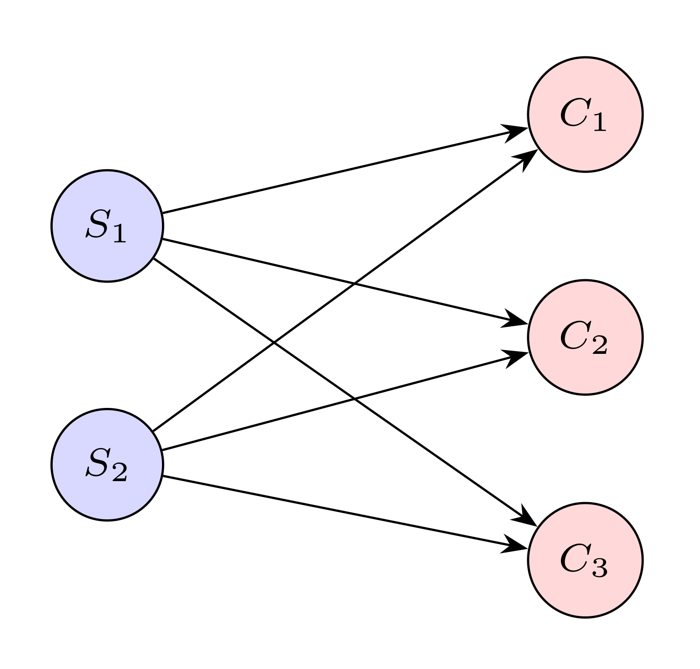
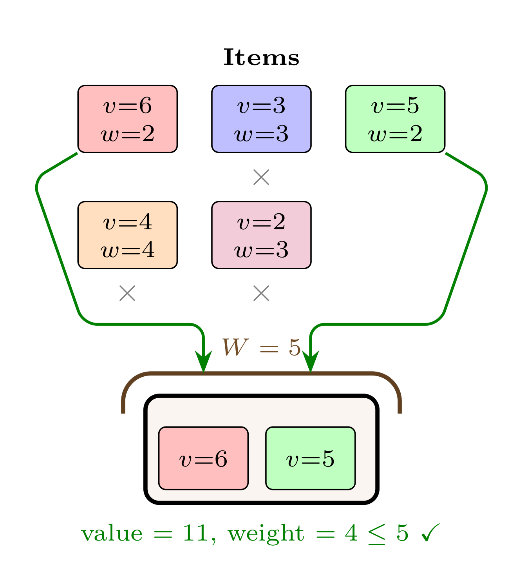
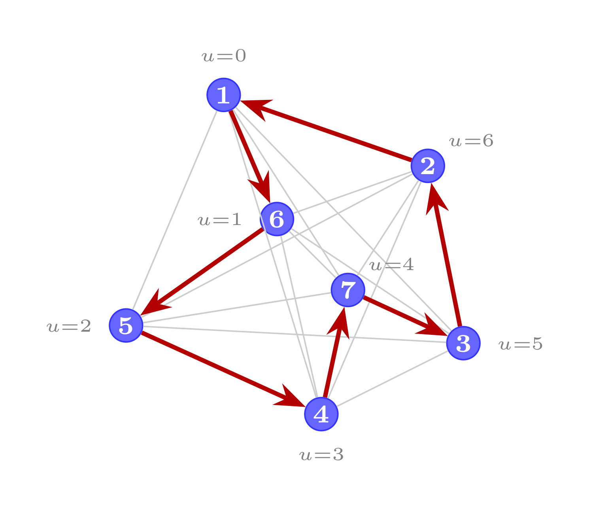
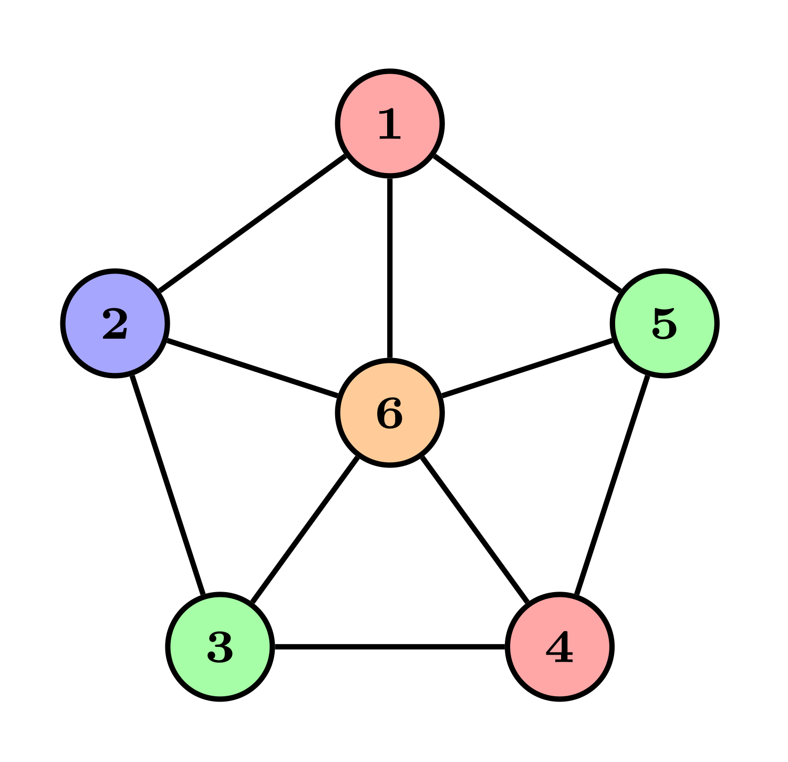
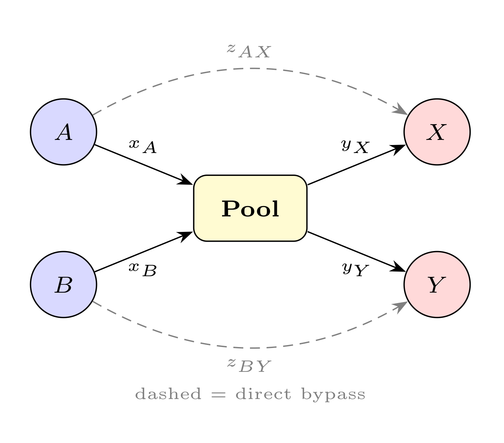
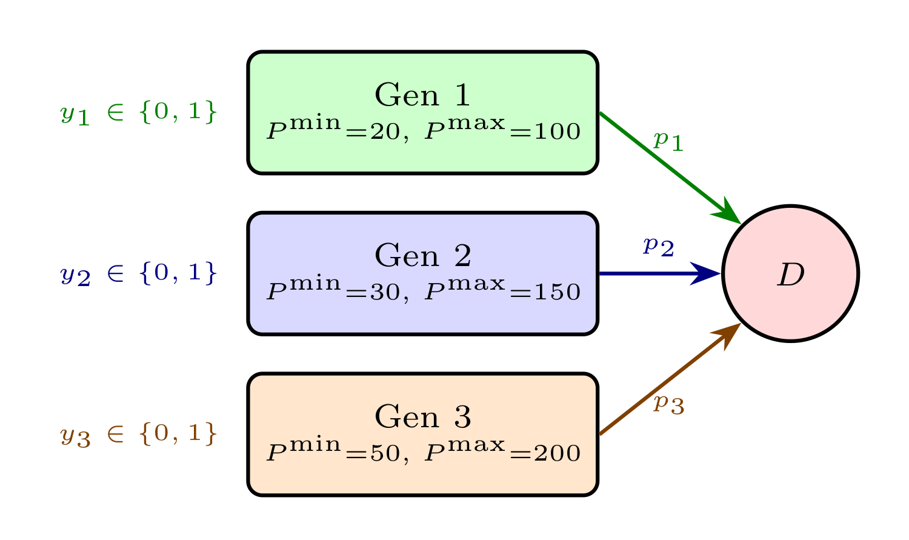

# Part 1: Modeling with PySCIPOpt

Part 1 of this workshop introduces PySCIPOpt through a series of progressively more complex optimization models. Starting from a minimal integer program, we build up to classic optimization problems: transportation, knapsack, TSP, graph coloring, and nonlinear blending. By the end, you will be comfortable creating models, adding variables and constraints, solving, and inspecting solutions.

Each section explains the problem and its mathematical formulation, then points to an exercise file where you must implement the model. Every exercise includes a test script to verify correctness.

> **Documentation:** PySCIPOpt tutorials are available at [pyscipopt.readthedocs.io](https://pyscipopt.readthedocs.io/en/latest/tutorials/index.html).

## Section 1. Getting Started with PySCIPOpt

The fundamental workflow in PySCIPOpt follows a simple lifecycle:

1. **Create** a `Model` object.
2. **Add variables** specifying their type and objective coefficient.
3. **Add constraints** using algebraic expressions.
4. **Set the objective direction** (minimize or maximize).
5. **Optimize** the model.
6. **Query** the solution.

PySCIPOpt supports three main variable types:

| Type | Code | Description |
|------|------|-------------|
| Continuous | `"C"` | Takes any real value within bounds |
| Binary | `"B"` | Takes value 0 or 1 |
| Integer | `"I"` | Takes any integer value within bounds |

Variables are created with `model.addVar()`, constraints with `model.addCons()`. Here is a minimal example:

```python
from pyscipopt import Model

model = Model("Example")
x = model.addVar(name="x", vtype="B", obj=3)
y = model.addVar(name="y", vtype="B", obj=2)
model.addCons(x + y <= 1)
model.setMaximize()
```

> The `obj` parameter in `addVar` sets the coefficient of that variable in the objective function. This avoids the need for a separate `setObjective()` call in many cases.

### Exercise 1: First Model

**Your task:** Implement the function `first_model()` in [`ex01_first_model/first_model.py`](ex01_first_model/first_model.py).

Build the following binary integer program:

$$
\begin{align*}
    \max \quad & 3x + 2y \\
    \text{subject to} \quad & x + y \leq 1 \\
    & 2x + y \leq 2 \\
    & x, y \in \{0, 1\}
\end{align*}
$$

Return `(model, x, y)` — the unsolved model and the two variables.

**Test:** `python ex01_first_model/test_first_model.py`

## Section 2. Solving and Inspecting Solutions

Once a model is built, calling `model.optimize()` triggers the solver. After optimization, PySCIPOpt provides several methods to inspect the result:

- `model.getStatus()` returns the solving status as a string (e.g. `"optimal"`, `"infeasible"`).
- `model.getObjVal()` returns the optimal objective value.
- `model.getVal(var)` returns the value of a variable in the best solution found.
- `model.getVars()` returns the list of all variables in the model.
- `model.getNNodes()` returns the number of branch-and-bound nodes explored.
- `model.getSolvingTime()` returns the wall-clock solving time in seconds.

If you want to suppress solver output, call `model.hideOutput()` before `optimize()`.

```python
model.hideOutput()
model.optimize()

print("Status:", model.getStatus())
print("Objective:", model.getObjVal())
for var in model.getVars():
    print(f"  {var.name} = {model.getVal(var)}")
print("Nodes:", model.getNNodes())
print("Time:", model.getSolvingTime())
```

### Exercise 2: Solve and Report

**Your task:** Implement the function `solve_and_report(model)` in [`ex02_solving/solving.py`](ex02_solving/solving.py).

Given a pre-built (but not yet optimized) model, optimize it and return a dictionary with the following keys:

| Key | Type | Description |
|-----|------|-------------|
| `"status"` | `str` | Solving status |
| `"objective"` | `float` | Optimal objective value |
| `"variables"` | `dict` | Mapping of variable name to its value |
| `"n_nodes"` | `int` | Number of B&B nodes explored |
| `"time"` | `float` | Solving time in seconds |

**Test:** `python ex02_solving/test_solving.py`

## Section 3. Solver Parameters

SCIP exposes hundreds of parameters that control the solving process. In this exercise you will learn to set some: time limits, optimality gap limits, and emphasis settings. You will also learn to load models from standard file formats.

Key methods:

- `model.setParam("limits/time", seconds)` — stop after a time limit
- `model.setParam("limits/gap", gap)` — stop when the relative optimality gap is small enough
- `model.setParam("emphasis/feasibility", 1)` — set a solving emphasis (also `"emphasis/optimality"`)
- `model.readProblem(filepath)` — load a model from an MPS or LP file
- `model.getGap()` — get the relative gap between primal and dual bound

### Exercise 3: Parameters

**Your task:** Implement the two functions in [`ex03_parameters/parameters.py`](ex03_parameters/parameters.py):

| Function | What it does |
|----------|-------------|
| `solve_with_params(model, params)` | Apply a dict of SCIP parameters and solve |
| `load_and_solve(filepath, params)` | Load a model from file and solve with optional parameters |

Each function returns a dictionary with the relevant statistics (status, objective, gap, time, n_nodes).

**Test:** `python ex03_parameters/test_parameters.py`

### Exercise 3b: MIPLIB Instances

[MIPLIB](https://miplib.zib.de) is the standard benchmark library for mixed-integer programming. Six small instances are included in `ex03_parameters/miplib_data/`:

| Instance | Rows | Cols | Description |
|----------|------|------|-------------|
| `p0033` | 16 | 33 | Capital budgeting |
| `enigma` | 21 | 100 | Puzzle |
| `flugpl` | 18 | 18 | Flight planning |
| `misc03` | 96 | 160 | Miscellaneous |
| `stein27` | 118 | 27 | Steiner triple |
| `gen-ip054` | 30 | 30 | General IP |

**Your task:** Use `model.readProblem()` and `load_and_solve()` from Exercise 3 to load and solve these instances. Collect status, objective, time, nodes, and gap for each.

## Section 4. Transportation Problem

The transportation problem is one of the earliest applications of linear programming. A set of suppliers, each with a limited supply, must ship goods to a set of customers, each with a specific demand. Shipping one unit from supplier $i$ to customer $j$ costs $c_{ij}$. The goal is to satisfy all demands at minimum total shipping cost.

<p align="center"></p>

$$
\begin{align*}
    \min \quad & \sum_{i \in S} \sum_{j \in D} c_{ij} \, x_{ij} \\
    \text{subject to} \quad & \sum_{j \in D} x_{ij} \leq s_i, \quad & \forall \, i \in S \\
    & \sum_{i \in S} x_{ij} \geq d_j, \quad & \forall \, j \in D \\
    & x_{ij} \geq 0, \quad & \forall \, i \in S, \, j \in D
\end{align*}
$$

where $s_i$ is the supply at source $i$ and $d_j$ is the demand at customer $j$.

> This is a pure LP (no integer variables). The constraint matrix of a transportation problem has a special structure (it is totally unimodular), so the LP relaxation always gives an integer optimal solution.

### Exercise 4: Transportation

**Your task:** Implement the function `transportation(supply, demand, costs)` in [`ex04_transportation/transportation.py`](ex04_transportation/transportation.py).

Return `(model, x)` — the unsolved model and a dict mapping `(i, j)` to continuous shipping variables.

**Test:** `python ex04_transportation/test_transportation.py`

## Section 5. 0-1 Knapsack

The 0-1 knapsack problem is perhaps the most studied problem in combinatorial optimization. Given a set of items, each with a weight $w_i$ and a value $v_i$, and a knapsack with capacity $C$, select items to maximize total value without exceeding the capacity.

<p align="center"></p>

$$
\begin{align*}
    \max \quad & \sum_{i} v_i \, x_i \\
    \text{subject to} \quad & \sum_{i} w_i \, x_i \leq C \\
    & x_i \in \{0, 1\}, \quad & \forall \, i
\end{align*}
$$

Applications: capital budgeting, cargo loading, resource allocation, and as a subproblem in column generation (Part 3).

> The LP relaxation of the knapsack problem has a simple greedy solution: sort items by value-to-weight ratio and pack greedily. The gap between the LP relaxation and the IP optimum is typically small, making branch-and-bound very effective.

### Exercise 5: Knapsack

**Your task:** Implement the function `knapsack(weights, values, capacity)` in [`ex05_knapsack/knapsack.py`](ex05_knapsack/knapsack.py).

Return `(model, x)` — the unsolved model and a dict mapping item index to its binary variable.

**Test:** `python ex05_knapsack/test_knapsack.py`

## Section 6. TSP — Compact MTZ Formulation

The Traveling Salesman Problem (TSP) asks for the shortest tour that visits each city exactly once and returns to the start. The Miller-Tucker-Zemlin (MTZ) formulation uses position variables $u_i$ to eliminate subtours with a polynomial number of constraints:

<p align="center"></p>

$$
\begin{align*}
    \min \quad & \sum_{i \neq j} d_{ij} \, x_{ij} \\
    \text{subject to} \quad & \sum_{j \neq i} x_{ij} = 1 \quad \forall \, i \\
    & \sum_{i \neq j} x_{ij} = 1 \quad \forall \, j \\
    & u_i - u_j + n \, x_{ij} \leq n - 1 \quad \forall \, i, j \neq 0 \\
    & x_{ij} \in \{0, 1\}
\end{align*}
$$

Simple to implement but has a weak LP relaxation. Part 2 shows a stronger approach with row generation.

### Exercise 6: TSP (MTZ)

**Your task:** Implement the function `tsp_mtz(distances)` in [`ex06_tsp_mtz/tsp_mtz.py`](ex06_tsp_mtz/tsp_mtz.py).

Return `(model, x)` — the unsolved model and a dict mapping `(i, j)` to binary edge variables.

**Test:** `python ex06_tsp_mtz/test_tsp_mtz.py`

## Section 7. Graph Coloring

Given an undirected graph $G = (V, E)$, the graph coloring problem asks for an assignment of colors to nodes such that no two adjacent nodes share the same color, using the minimum number of colors. This minimum is called the chromatic number $\chi(G)$.

<p align="center"></p>

We introduce binary variables $x_{vk}$ (node $v$ receives color $k$) and $w_k$ (color $k$ is used), with $K$ as an upper bound on the number of colors:

$$
\begin{align*}
    \min \quad & \sum_{k=1}^{K} w_k \\
    \text{subject to} \quad & \sum_{k=1}^{K} x_{vk} = 1, \quad & \forall \, v \in V \\
    & x_{uk} + x_{vk} \leq w_k, \quad & \forall \, (u, v) \in E, \, \forall \, k \\
    & x_{vk}, w_k \in \{0, 1\}
\end{align*}
$$

**Symmetry breaking:** $w_k \geq w_{k+1}$ forces colors to be used in order.

> Graph coloring is NP-hard and notoriously difficult for IP solvers due to the inherent symmetry. Symmetry-breaking constraints are essential for practical performance.

### Exercise 7: Graph Coloring

**Your task:** Implement the function `graph_coloring(n_nodes, edges, max_colors)` in [`ex07_graph_coloring/graph_coloring.py`](ex07_graph_coloring/graph_coloring.py).

Return `(model, x, w)` — the unsolved model, a dict `x` mapping `(v, k)` to binary assignment variables, and a dict `w` mapping color index `k` to binary usage variables. Include the symmetry-breaking constraints.

**Test:** `python ex07_graph_coloring/test_graph_coloring.py`

## Section 8. Nonlinear Blending (Pooling Problem)

The pooling problem is a classic nonlinear optimization problem from the process industry. Raw materials with known qualities are blended through a mixing pool to produce products that must meet quality specifications.

<p align="center"></p>

$$
\begin{align*}
    \max \quad & \sum_{p} r_p \, d_p - \sum_{s} c_s \left( x_s + \sum_{p} z_{sp} \right) \\
    \text{s.t.} \quad & \sum_{s} x_s = \sum_{p} y_p && \text{(balance)} \\
    & \lambda \sum_{s} x_s = \sum_{s} q_s \, x_s && \text{(pool quality)} \\
    & \lambda \, y_p + \sum_{s} q_s \, z_{sp} \leq \bar{q}_p \, d_p && \forall \, p \\
    & d_p = y_p + \sum_{s} z_{sp} && \forall \, p
\end{align*}
$$

The terms $\lambda \cdot x_s$ and $\lambda \cdot y_p$ are **bilinear** (nonconvex). SCIP solves these globally via spatial branch-and-bound.

### Exercise 8: Blending

**Your task:** Implement the function `blending(sources, products)` in [`ex08_blending/blending.py`](ex08_blending/blending.py).

Return `(model, x, y, z, l)` — the unsolved model and the variable dicts/variable.

**Test:** `python ex08_blending/test_blending.py`

## Section 9. Indicator Constraints

Indicator constraints are a modeling tool for conditional logic: "if binary variable $y = 1$, then constraint $g(x) \leq 0$ must hold." The traditional approach is big-M linearization, which replaces the conditional with $g(x) \leq M(1 - y)$ for a large constant $M$. This works but introduces numerical difficulties and weakens the LP relaxation.

SCIP supports indicator constraints natively via `model.addConsIndicator()`, avoiding the need for big-M constants entirely. The solver handles the disjunction internally, often producing tighter relaxations and better performance.

We model a generator scheduling problem: a set of generators must meet a total electricity demand. Each generator $i$ has a fixed startup cost $f_i$, a variable cost $c_i$ per MW, and minimum/maximum output levels $[\underline{p}_i, \bar{p}_i]$.

<p align="center"></p>

$$
\begin{align*}
    \min \quad & \sum_{i} f_i \, y_i + \sum_{i} c_i \, p_i \\
    \text{s.t.} \quad & \sum_{i} p_i \geq D \\
    & p_i \leq \bar{p}_i \, y_i \quad & \forall \, i \\
    & y_i = 1 \implies p_i \geq \underline{p}_i \quad & \forall \, i \\
    & y_i \in \{0, 1\}, \; p_i \geq 0
\end{align*}
$$

### Exercise 9: Indicator Constraints

**Your task:** Implement both formulations in [`ex09_indicators/indicators.py`](ex09_indicators/indicators.py):

- `generator_scheduling_bigm(...)` — use big-M constraints: $p_i \geq \underline{p}_i \, y_i$
- `generator_scheduling_indicator(...)` — use `model.addConsIndicator()` for the minimum output constraint

Both functions return `(model, y, p)` — the unsolved model, binary on/off dicts, and continuous output dicts.

**Test:** `python ex09_indicators/test_indicators.py`

## Section 10. Benchmarking Formulations

Modeling is only half the story — understanding how your formulation affects solver performance is equally important. In this exercise you will systematically compare the big-M and indicator formulations from Exercise 9 on random instances of increasing size.

### Exercise 10a: Instance Generation

**Your task:** Implement `generate_instance(n_generators, seed)` in [`ex10_benchmarking/benchmarking.py`](ex10_benchmarking/benchmarking.py).

Given a number of generators and a random seed, return `(demand, fixed_costs, var_costs, p_min, p_max)` — all lists of length `n_generators`, plus a scalar demand set to ~60% of total capacity.

### Exercise 10b: Benchmarking

**Your task:** Implement `benchmark_formulation()` and `compare_formulations()` in [`ex10_benchmarking/benchmarking.py`](ex10_benchmarking/benchmarking.py).

For each instance size, generate an instance, solve with both formulations, and collect: solving time, number of B&B nodes, and optimality gap.

**Run:** `python ex10_benchmarking/benchmarking.py`
**Test:** `python ex10_benchmarking/test_benchmarking.py`

---

Once all exercises pass, proceed to **Part 2** (row generation for TSP) and **Part 3** (branch-and-price for bin packing).
