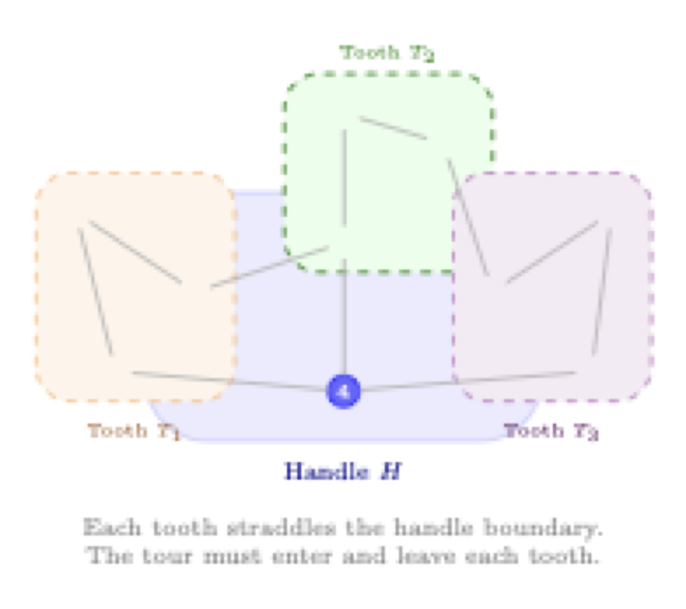

# Part 2: Row Generation for the Traveling Salesman Problem

This tutorial demonstrates **row generation** (cutting planes / lazy constraints) using the symmetric Traveling Salesman Problem (TSP). Row generation is the dual concept to column generation: instead of adding variables dynamically, we add constraints dynamically.

## The Traveling Salesman Problem

Given $n$ cities and distances $d_{ij}$ between each pair, find the shortest tour that visits each city exactly once and returns to the starting city.

For symmetric TSP: $d_{ij} = d_{ji}$ (undirected edges).

> **Prerequisite:** Complete Exercise 6 (TSP MTZ) in Part 1 first. The compact formulation is used here as a baseline for comparison.

---

## 1. Edge Formulation with Subtour Elimination Constraints

For symmetric TSP, we use undirected edge variables with degree constraints and subtour elimination constraints (SECs).

### Variables
- $x_e \in \{0, 1\}$ for each edge $e = \{i, j\}$

### Formulation

$$
\begin{align}
\min \quad & \sum_{e \in E} d_e x_e \\
\text{s.t.} \quad & \sum_{e \in \delta(i)} x_e = 2 && \forall i \in V \quad \text{(degree constraints)} \\
& \sum_{e \in E(S)} x_e \leq |S| - 1 && \forall S \subset V, 2 \leq |S| \leq n-1 \quad \text{(SECs)} \\
& x_e \in \{0, 1\}
\end{align}
$$

Where:
- $\delta(i)$ = edges incident to node $i$
- $E(S)$ = edges with both endpoints in $S$

### Properties
- **Exponentially many SECs**: $O(2^n)$ constraints
- **Strong LP relaxation**: Much tighter than MTZ
- **Row generation needed**: Add SECs on-the-fly as violations are found

---

## 2. Row Generation (Cutting Planes)

Instead of adding all $2^n$ SECs upfront, we:
1. Solve with only degree constraints
2. Check if solution has subtours
3. Add SECs for violated subtours
4. Repeat until no violations

This is implemented via a **constraint handler** in SCIP.

### 2.1 Subtour Detection

Given an integer solution (selected edges), we need to detect subtours:

1. Build a graph from selected edges
2. Find connected components (using DFS, BFS, or Union-Find)
3. If multiple components exist, each is a subtour

**Example:**

<p align="center">
  
</p>

A valid tour (left) has a single connected component. Subtours (right) have multiple — each violates an SEC.

#### Exercise 1: Implement Subtour Detection

Complete `find_subtours()` in `subtour.py`:

```python
def find_subtours(selected_edges, n_nodes):
    """
    Find connected components in the graph defined by selected_edges.

    Returns: List of sets (subtours), or [] if single valid tour.
    """
    # Your implementation here
```

**Hints:**
- Build an adjacency list from edges
- Use DFS/BFS to find connected components
- Alternative: Union-Find data structure

**Test your implementation:**
```bash
python test_subtour.py
```

### 2.2 Constraint Handler

SCIP's constraint handler interface allows adding constraints lazily:

| Callback | Purpose |
|----------|---------|
| `conscheck` | Verify if a solution is feasible |
| `consenfolp` | Enforce constraints, add cuts if violated |

#### Exercise 2: Implement the Constraint Handler

Complete the callbacks in `conshdlr_subtour.py`:

**Part A: `conscheck`** — verify an integer solution
```python
def conscheck(self, constraints, solution, ...):
    # 1. Extract selected edges from solution
    #    Use self.model.getSolVal(solution, var) to get a variable's value
    # 2. Call find_subtours()
    # 3. Return {"result": SCIP_RESULT.FEASIBLE} or INFEASIBLE
```

**Part B: `consenfolp`** — enforce constraints on the LP solution
```python
def consenfolp(self, constraints, nusefulconss, solinfeasible):
    # 1. Get LP values — use self.model.getVal(var) (no solution argument)
    # 2. Find subtours in edges with x > 0.5
    # 3. For each subtour S, add SEC with self.model.addCons(...)
    # 4. Return {"result": SCIP_RESULT.CONSADDED} or FEASIBLE
```

**Key API differences:** `conscheck` receives a `solution` object and uses `getSolVal(solution, var)`. `consenfolp` works on the current LP and uses `getVal(var)` directly.

**Test your implementation:**
```bash
python test_tsp.py
```

### 2.3 How It Works Together

<p align="center">
  
</p>

---

## Exercise 3: Computational Experiments (MTZ vs Row Generation)

Now that both formulations work, compare them experimentally. Complete `experiments.py`:

```bash
python experiments.py
```

Solve the same TSP instances with MTZ and row generation across increasing sizes. Print a comparison table with solving time, B&B nodes, and LP bound.

**Questions to answer:**
- How does the LP relaxation bound compare between the two formulations?
- At what instance size does the difference in B&B nodes become significant?
- Which formulation is faster for small instances? For large instances?

---

## 3. Bonus Exercises

### 3.1 Min-Cut Separation

Our current `consenfolp` only separates **integer** solutions by finding connected components. This misses violated SECs in **fractional** LP solutions, where every node may be connected but a subset $S$ still violates $\sum_{e \in E(S)} x_e \leq |S| - 1$.

The fix is min-cut separation:

1. Build a graph with edge capacities equal to the LP values $x_e$.
2. For each pair of nodes $(s, t)$, compute a minimum $s$-$t$ cut.
3. If the min-cut value is $< 2$, the cut defines a violated SEC — add it.

**Implementation hints:**
- Use `networkx.minimum_cut` or implement max-flow yourself.
- Add a `conssepalp` callback to the constraint handler (called on fractional LP solutions, unlike `consenfolp` which is called on integer solutions).
- Compare solve times with and without fractional separation.

### 3.2 Stronger Valid Inequalities

SECs are not the only cuts that help for TSP. Two important families:

- **2-matching inequalities:** Imagine a tour crosses a "blob" of cities — it must cross the boundary an even number of times. 2-matching inequalities exploit situations where the LP relaxation cheats by using fractional values that violate this parity. They cut off fractional solutions that SECs alone cannot.

- **Comb inequalities:** A generalization of 2-matching. Picture a "handle" (a set of cities) with several "teeth" (smaller sets that straddle the handle boundary). The tour must use enough edges to enter and leave each tooth, which gives a lower bound on edge usage. Comb inequalities are the main workhorse of Concorde, the state-of-the-art exact TSP solver.

<p align="center">
  
</p>

Finding violated combs is hard in general, but heuristic separation works well in practice. See Applegate et al. (2006) for details.

---

## Quick Start

```bash
# Run MTZ formulation (works immediately)
python main.py --compact --cities 15

# After completing exercises, run row generation
python main.py --cities 15

# Compare both on same instance
python main.py --compact --cities 20 --seed 42
python main.py --cities 20 --seed 42
```

---

## References

- Miller, Tucker, Zemlin (1960): "Integer Programming Formulation of Traveling Salesman Problems"
- Dantzig, Fulkerson, Johnson (1954): "Solution of a Large-Scale Traveling-Salesman Problem"
- Applegate, Bixby, Chvátal, Cook (2006): "The Traveling Salesman Problem: A Computational Study"
