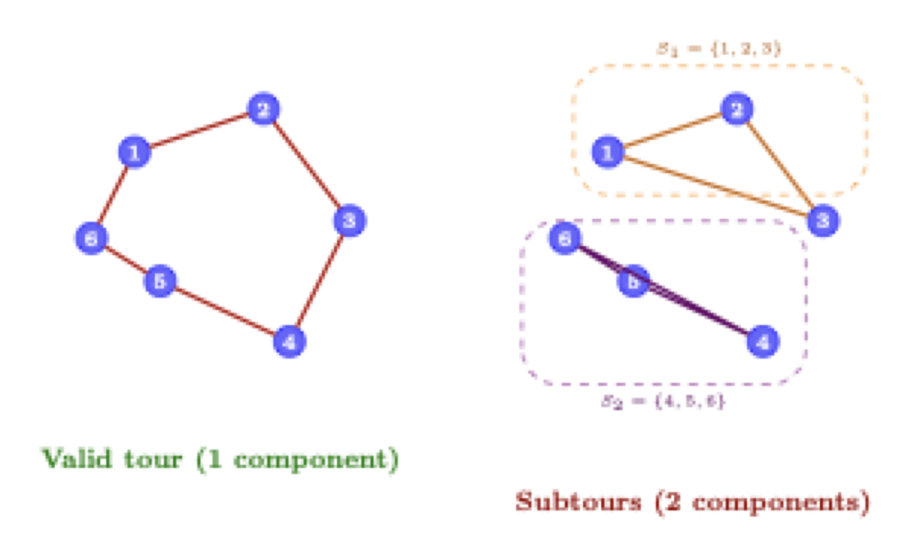
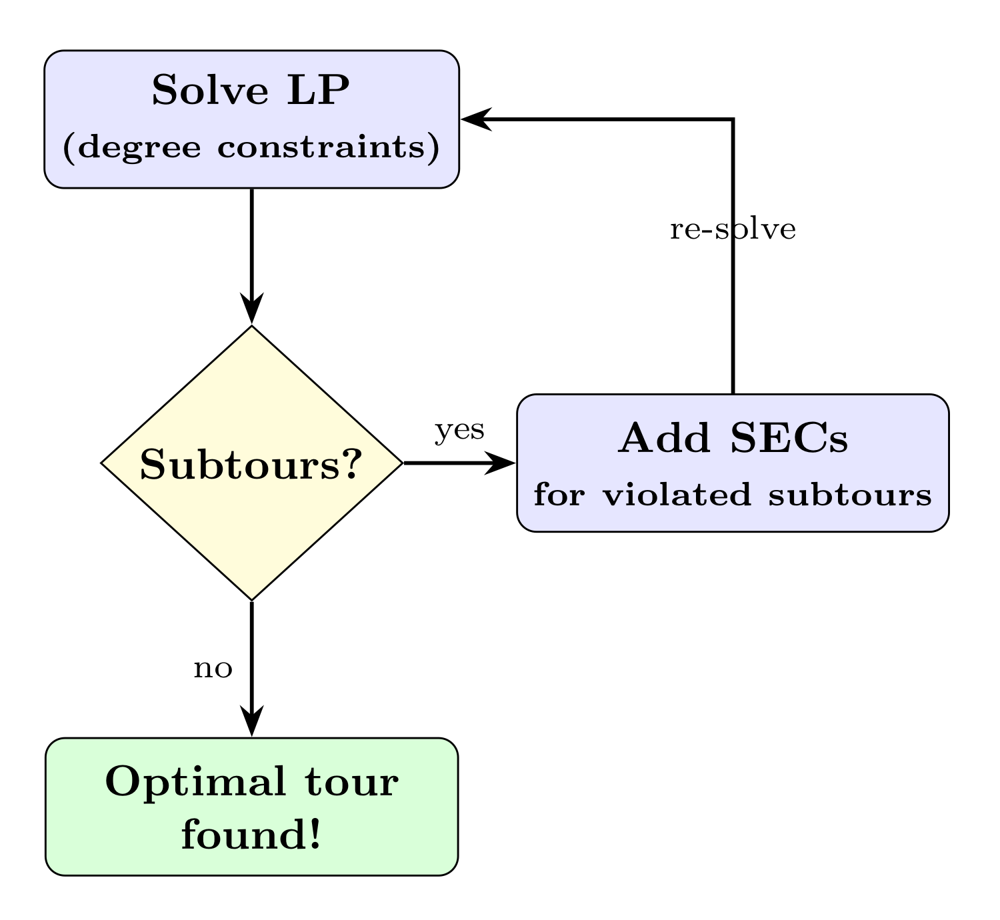

# Part 2: Row Generation for the Traveling Salesman Problem

This tutorial demonstrates **row generation** (cutting planes / lazy constraints) using the symmetric Traveling Salesman Problem (TSP). Row generation is the dual concept to column generation: instead of adding variables dynamically, we add constraints dynamically.

## The Traveling Salesman Problem

Given $n$ cities and distances $d_{ij}$ between each pair, find the shortest tour that visits each city exactly once and returns to the starting city.

For symmetric TSP: $d_{ij} = d_{ji}$ (undirected edges).

> **Prerequisite:** Complete Exercise 6 (TSP MTZ) in Part 1 first. The compact formulation is used here as a baseline for comparison.

---

## 1. Edge Formulation with Subtour Elimination Constraints

For symmetric TSP, we use undirected edge variables with degree constraints and subtour elimination constraints (SECs).

<p align="center"></p>

$$
\begin{align}
\min \quad & \sum_{e \in E} d_e x_e \\
\text{s.t.} \quad & \sum_{e \in \delta(i)} x_e = 2 && \forall i \in V \quad \text{(degree)} \\
& \sum_{e \in E(S)} x_e \leq |S| - 1 && \forall S \subset V \quad \text{(SECs)} \\
& x_e \in \{0, 1\}
\end{align}
$$

- **Exponentially many SECs**: $O(2^n)$ constraints
- **Strong LP relaxation**: much tighter than MTZ
- **Row generation**: add SECs on-the-fly as violations are found

---

## 2. Row Generation (Cutting Planes)

Instead of adding all $2^n$ SECs upfront, we:
1. Solve with only degree constraints
2. Check if solution has subtours
3. Add SECs for violated subtours
4. Repeat until no violations

This is implemented via a **constraint handler** in SCIP.

### 2.1 Subtour Detection

Given an integer solution (selected edges), we need to detect subtours:

1. Build a graph from selected edges
2. Find connected components (using DFS, BFS, or Union-Find)
3. If multiple components exist, each is a subtour

#### Exercise 1 (optional): Subtour Detection

Complete `find_subtours()` in [`subtour.py`](subtour.py):

```python
def find_subtours(selected_edges, n_nodes):
    """
    Find connected components in the graph defined by selected_edges.

    Returns: List of sets (subtours), or [] if single valid tour.
    """
    # Your implementation here
```

**Hints:**
- Build an adjacency list from edges
- Use DFS/BFS to find connected components
- Alternative: Union-Find data structure

> **Shortcut:** Use [NetworkX](https://networkx.org/) (`pip install networkx`):
> ```python
> import networkx as nx
> G = nx.Graph()
> G.add_nodes_from(range(n_nodes))
> G.add_edges_from(selected_edges)
> components = list(nx.connected_components(G))
> ```

**Test your implementation:**
```bash
python test_subtour.py
```

### 2.2 Constraint Handler

SCIP's constraint handler interface allows adding constraints lazily:

| Callback | Purpose |
|----------|---------|
| `conscheck` | Verify if a solution is feasible |
| `consenfolp` | Enforce constraints, add cuts if violated |

#### Exercise 2: Implement the Constraint Handler

Complete the callbacks in [`conshdlr_subtour.py`](conshdlr_subtour.py):

**Part A: `conscheck`** — verify an integer solution
```python
def conscheck(self, constraints, solution, ...):
    # 1. Extract selected edges from solution
    #    Use self.model.getSolVal(solution, var) to get a variable's value
    # 2. Call find_subtours()
    # 3. Return {"result": SCIP_RESULT.FEASIBLE} or INFEASIBLE
```

**Part B: `consenfolp`** — enforce constraints on the LP solution
```python
def consenfolp(self, constraints, nusefulconss, solinfeasible):
    # 1. Get LP values — use self.model.getSolVal(None, var)
    # 2. Find subtours in edges with value > 0 (use model.isGT for numerical safety)
    # 3. For each subtour S, add SEC with self.model.addCons(...)
    # 4. Return {"result": SCIP_RESULT.CONSADDED} or FEASIBLE
```

> **Important:** In `consenfolp`, use `getSolVal(None, var)` to get the current LP value (passing `None` as the solution). Include **all edges with positive value** — this ensures subtours are detected in fractional LP solutions too. Use `model.isGT(value, 0)` instead of `value > 0` for numerical safety with SCIP's tolerances.

**Test your implementation:**
```bash
python test_tsp.py
```

### 2.3 How It Works Together

<p align="center">
  
</p>

---

## Computational Experiments & Visualization

Once the exercises are complete, run experiments and visualize solutions:

```bash
# Compare MTZ vs Row Generation across instance sizes
python experiments.py

# Visualize a solution
python visualize.py --cities 20 --seed 42
python visualize.py --cities 20 --seed 42 --compact   # MTZ for comparison
python visualize.py --cities 150 --seed 0              # larger instance
```

---

## Quick Start

```bash
# Run MTZ formulation (works immediately)
python main.py --compact --cities 15

# After completing exercises, run row generation
python main.py --cities 15

# Compare both on same instance
python main.py --compact --cities 20 --seed 42
python main.py --cities 20 --seed 42
```

---

## References

- Miller, Tucker, Zemlin (1960): "Integer Programming Formulation of Traveling Salesman Problems"
- Dantzig, Fulkerson, Johnson (1954): "Solution of a Large-Scale Traveling-Salesman Problem"
- Applegate, Bixby, Chvátal, Cook (2006): "The Traveling Salesman Problem: A Computational Study"
